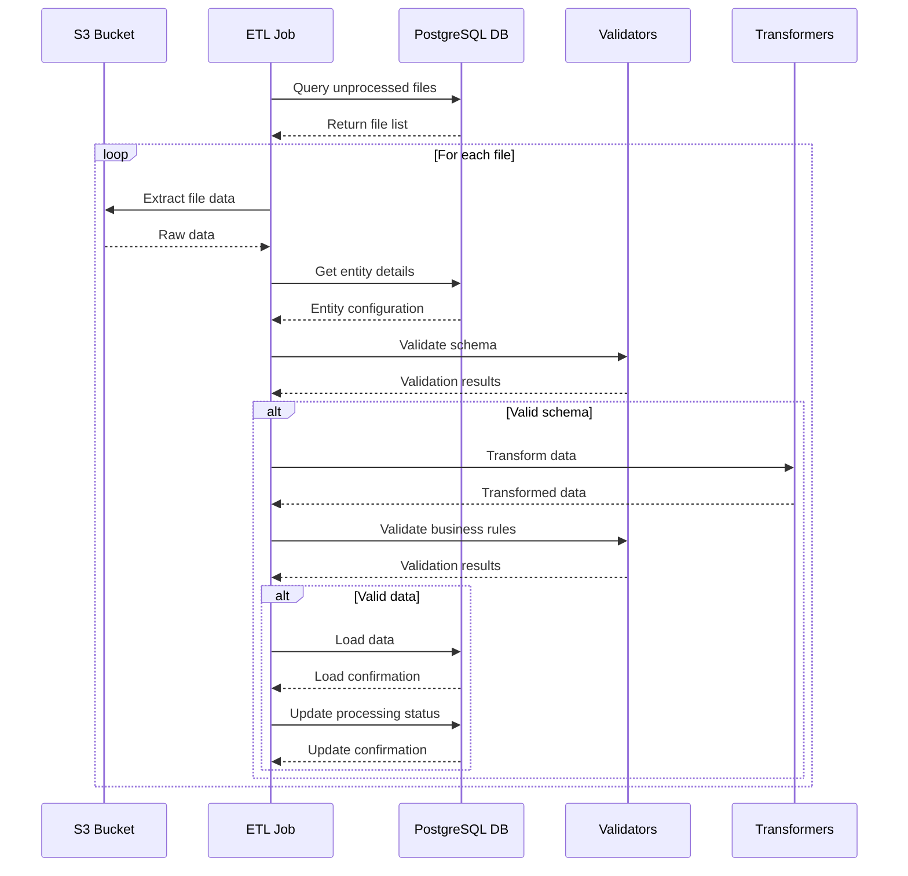

# File Standardization ETL Job

This project implements a modular ETL (Extract, Transform, Load) job for standardizing files in AWS Glue. The job processes files from S3, transforms them according to predefined schemas, and loads them into a PostgreSQL database.

## Project Structure

```
project/
├── config/
│   ├── __init__.py
│   ├── settings.py           # Configuration settings
│   └── queries.py           # SQL queries
├── src/
│   ├── __init__.py
│   ├── database/
│   │   ├── __init__.py
│   │   ├── connection.py    # Database connection handling
│   │   └── operations.py    # Database operations
│   ├── etl/
│   │   ├── __init__.py
│   │   ├── extractors.py    # Data extraction logic
│   │   ├── transformers.py  # Data transformation logic
│   │   └── loaders.py       # Data loading logic
│   ├── models/
│   │   ├── __init__.py
│   │   ├── stock.py        # Stock data model
│   │   └── sales.py        # Sales data model
│   ├── business/
│   │   ├── __init__.py
│   │   ├── rules.py        # Business validation rules
│   │   ├── transformations.py # Business transformations
│   │   └── special_cases.py # Special case handlers
│   ├── validation/
│   │   ├── __init__.py
│   │   ├── schema_validator.py # Schema validation
│   │   └── data_validator.py  # Business data validation
│   └── utils/
│       ├── __init__.py
│       ├── date_utils.py    # Date handling utilities
│       └── logging_utils.py # Logging utilities
├── tests/
│   └── __init__.py
├── file_standardization_job.py  # Main job script
└── requirements.txt
```

## Data Flow



## Features

- Modular and maintainable code structure
- Robust error handling and logging
- Support for both stock and sales data processing
- Configurable data schemas and transformations
- Special case handling for different data sources
- Temporary table management
- AWS Secrets Manager integration

## Prerequisites

- Python 3.7+
- AWS Glue environment
- PostgreSQL database
- Required Python packages (see requirements.txt)

## Configuration

1. Set up AWS credentials and permissions
2. Configure database connection in AWS Secrets Manager
3. Update settings in `config/settings.py` as needed
4. Ensure S3 bucket permissions are correctly set

## Usage

The job can be run as an AWS Glue job with the following parameters:

```bash
aws glue start-job-run --job-name file_standardization_job --arguments='--secret_name=db-credentials --env=dev'
```

## Data Processing Flow

1. **Extraction Phase**
   - Query unprocessed files from database
   - Read files from S3 bucket
   - Validate file sources and formats

2. **Transformation Phase**
   - Schema validation
   - Data cleaning and standardization
   - Business rule validation
   - Special case processing

3. **Loading Phase**
   - Create temporary tables
   - Load transformed data
   - Update processing status
   - Cleanup operations

## Error Handling

- Comprehensive error logging
- Graceful failure handling
- Transaction management
- File-level error isolation

## Monitoring and Logging

- Detailed operation logging
- Performance metrics
- Error tracking
- Processing status monitoring

## Contributing

1. Fork the repository
2. Create a feature branch
3. Commit your changes
4. Push to the branch
5. Create a Pull Request

## License

This project is licensed under the MIT License - see the LICENSE file for details.
